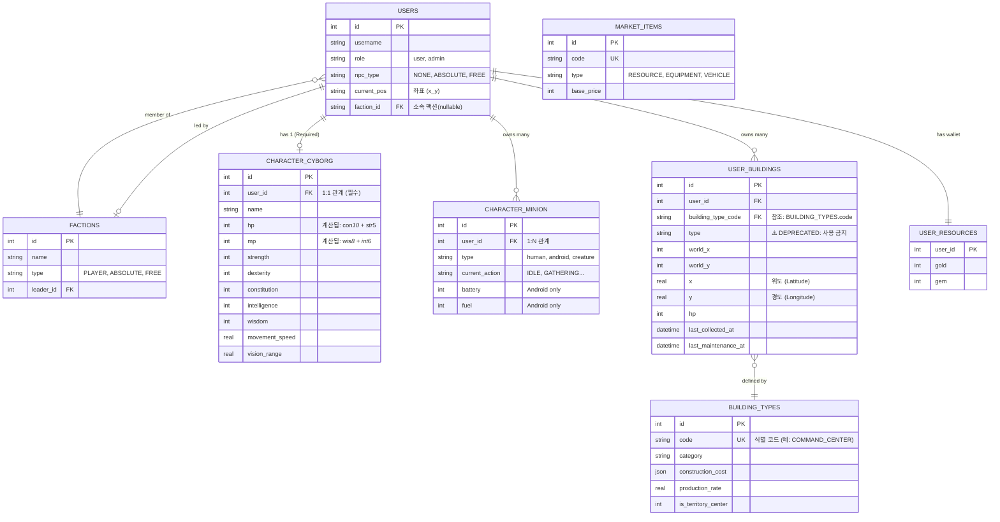

# 📜 AntiGravt01 Database Schema

> [!CAUTION]
> **🤖 [AI 개발자 필독] 데이터베이스 작업 원칙**
> 
> 이 문서는 데이터베이스 구조의 **유일한 진실 공급원(Single Source of Truth)**입니다.
> 
> 1.  **스키마 확인 필수**: 쿼리를 작성하거나 데이터를 수정하기 전에 반드시 이 문서의 ERD와 제약조건을 확인하십시오.
> 2.  **원시 수정 금지**: `database.js`에 임의의 테이블을 추가하거나 컬럼을 변경하지 마십시오. 스키마 변경이 필요하면 `migration` 전략을 세우고 사용자 승인을 받으십시오.
> 3.  **팩토리 패턴 사용**: 테스트 데이터나 초기 데이터를 생성할 때는 반드시 유저, 사이보그, 기본 건물을 원자적으로 생성하는 **`UserFactory`**를 사용하십시오. 개별 `INSERT` 문 사용을 금지합니다.
> 4.  **Deprecated 컬럼 사용 금지**: `user_buildings` 테이블의 `type` 컬럼은 구버전입니다. 반드시 **`building_type_code`**를 사용하십시오.

---

## 🗺️ Entity Relationship Diagram (ERD)

---

## 🏗️ Table Standards & Rules

### 1. Users & Characters
*   **원칙**: 모든 `users` 레코드는 반드시 1개의 대응되는 `character_cyborg` 레코드를 가져야 합니다.
*   **이유**: 게임 내 모든 스탯 계산은 `character_cyborg`를 기준으로 수행됩니다. 없는 경우 치명적인 오류가 발생합니다.

### 2. Buildings (건물)
*   **원칙**: 건물 인스턴스(`user_buildings`)는 `building_type_code`를 통해 `building_types`의 메타데이터를 참조해야 합니다.
*   **주의**: 과거에 사용되던 `type` 컬럼은 호환성을 위해 남겨두었으나, 신규 코드에서는 값을 읽거나 쓰지 마십시오.

### 3. Factions (팩션)
*   **구조**: 팩션은 `factions` 테이블에 정의되며, `users.faction_id`를 통해 소속이 결정됩니다.
*   **순환 참조**: `factions.leader_id`는 유저를 가리키고, `users.faction_id`는 팩션을 가리킵니다. 생성 순서에 주의가 필요하므로 `UserFactory` 사용을 권장합니다.
